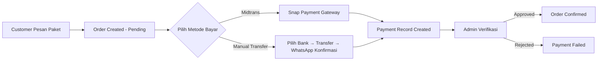
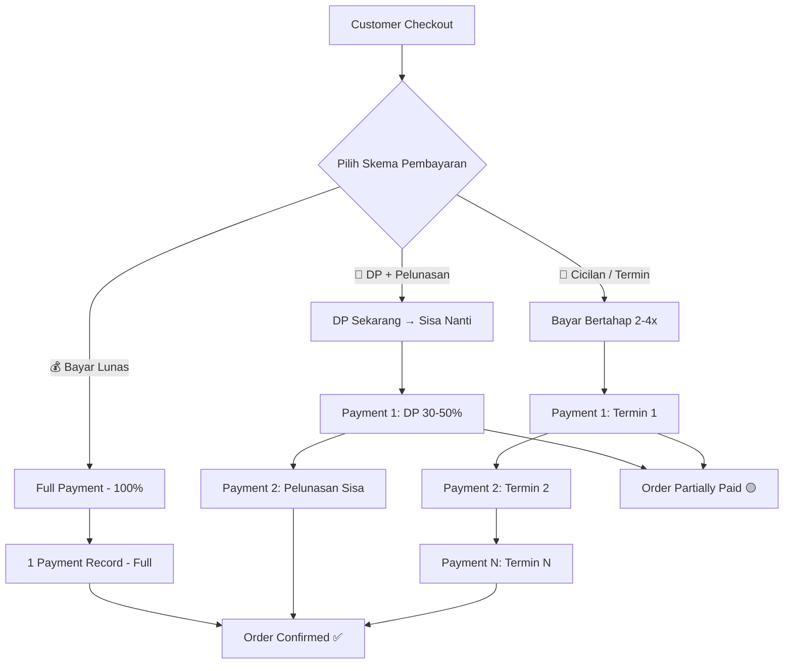
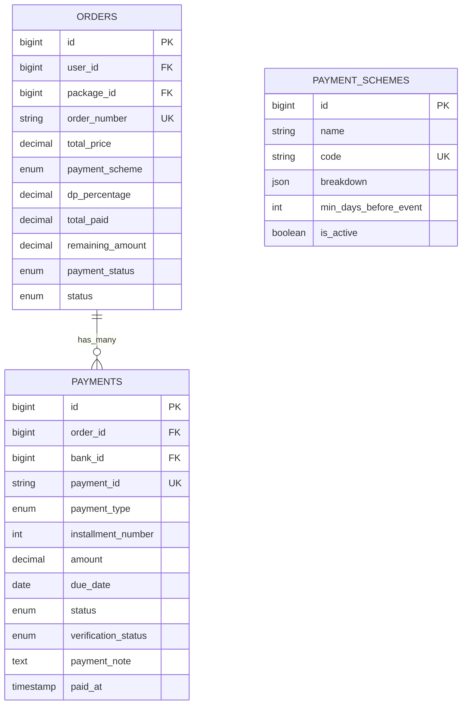
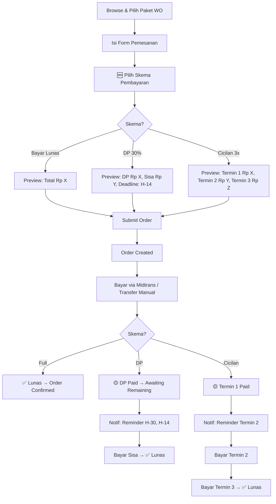
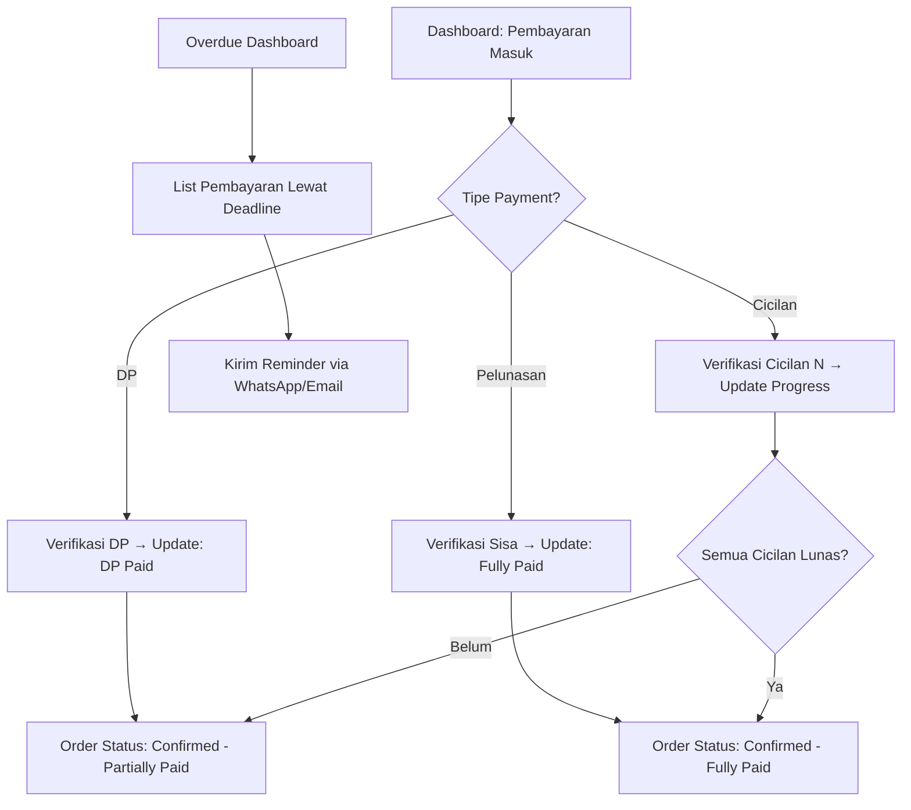
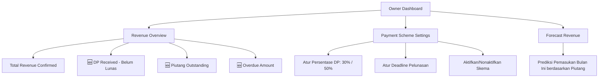

# 🎯 Implementation Plan: Sistem Pembayaran Fleksibel GemilangWO

## 📊 Analisis Arsitektur Saat Ini

### Status Quo — Apa yang Sudah Ada



### Database Schema Saat Ini

| Table | Key Columns | Catatan |
|-------|-------------|---------|
| `orders` | `user_id`, `package_id`, `total_price`, `status` (pending/confirmed/in_progress/completed/cancelled) | Relasi `hasOne(Payment)` — **hanya 1 payment per order** |
| `payments` | `order_id`, `payment_id`, `amount`, `status`, `payment_method`, `bank_id`, `verification_status` | **amount = total_price** (selalu full) |
| `banks` | `name`, `account_number`, `account_holder`, `instruction` | Bank tujuan transfer manual |

### 🔴 Temuan Masalah & Gap Kritis

| # | Masalah | Dampak |
|---|---------|--------|
| 1 | **Order → Payment relasi `hasOne`** | Hanya bisa 1 record pembayaran per order. Tidak bisa cicilan/multi-payment. |
| 2 | **Payment.amount selalu = Order.total_price** | Tidak ada konsep pembayaran parsial (DP). |
| 3 | **Tidak ada field `payment_type`** | Tidak bisa membedakan DP, pelunasan, cicilan. |
| 4 | **Tidak ada tracking sisa bayar** | Tidak tahu berapa yang sudah dibayar vs belum. |
| 5 | **Order status langsung `confirmed` setelah payment approved** | Tidak ada state "partially paid" atau "awaiting_remaining_payment". |
| 6 | **Customer payment view hanya menampilkan 1 kali bayar** | Tidak ada flow untuk bayar sisa/cicilan berikutnya. |
| 7 | **Admin/Owner tidak bisa melihat breakdown pembayaran** | Tidak ada visibilitas DP vs pelunasan. |
| 8 | **Tidak ada deadline pembayaran** | Pelunasan bisa tidak terbatas, berbahaya untuk bisnis. |

---

## 🏗️ Desain Solusi — Sistem Pembayaran Fleksibel

### Konsep Payment Scheme



### Skema Pembayaran yang Ditawarkan

| Skema | Deskripsi | Minimum | Deadline |
|-------|-----------|---------|----------|
| **Bayar Lunas** | 100% dibayar sekaligus | Full amount | Segera |
| **DP + Pelunasan** | DP 30-50%, sisa dibayar sebelum H-14 acara | 30% dari total | H-14 dari event_date |
| **Cicilan 2x** | 50% + 50% | 50% per termin | H-30 & H-14 |
| **Cicilan 3x** | 40% + 30% + 30% | Sesuai breakdown | H-60, H-30, H-14 |

> [!IMPORTANT]
> Persentase DP dan deadline bisa dikonfigurasi oleh Owner/Admin lewat settings.

---

## 📐 Desain Database (Migrasi)

### Migration 1: Tambah kolom di `orders`

```php
// Kolom baru di tabel orders
$table->enum('payment_scheme', ['full_payment', 'dp_installment', 'installment_2x', 'installment_3x'])
      ->default('full_payment')
      ->after('total_price');
$table->decimal('dp_percentage', 5, 2)->nullable()->after('payment_scheme');
$table->decimal('total_paid', 12, 2)->default(0)->after('dp_percentage');
$table->decimal('remaining_amount', 12, 2)->default(0)->after('total_paid');
$table->enum('payment_status', ['unpaid', 'dp_paid', 'partially_paid', 'fully_paid'])
      ->default('unpaid')
      ->after('remaining_amount');
```

### Migration 2: Tambah kolom di `payments`

```php
// Kolom baru di tabel payments
$table->enum('payment_type', ['full', 'dp', 'installment', 'remaining'])
      ->default('full')
      ->after('payment_method');
$table->integer('installment_number')->nullable()->after('payment_type');
$table->date('due_date')->nullable()->after('installment_number');
$table->text('payment_note')->nullable()->after('verification_notes');
```

### Migration 3: Tabel baru `payment_schemes` (Konfigurasi)

```php
Schema::create('payment_schemes', function (Blueprint $table) {
    $table->id();
    $table->string('name');                    // "DP 30%", "Cicilan 3x", dll
    $table->string('code')->unique();          // "dp_30", "installment_3x"
    $table->json('breakdown');                 // [{"percentage": 30, "label": "DP"}, {"percentage": 70, "label": "Pelunasan"}]
    $table->integer('min_days_before_event');   // Minimal berapa hari sebelum event
    $table->boolean('is_active')->default(true);
    $table->text('description')->nullable();
    $table->timestamps();
});
```

### ERD Baru (After)



> [!WARNING]
> Relasi `Order → Payment` **harus diubah dari `hasOne` menjadi `hasMany`**. Ini adalah breaking change yang perlu diperhatikan di semua tempat yang memanggil `$order->payment`.

---

## 🔧 Fase Implementasi

### Fase 1: Database & Model Layer
**Estimasi: 1-2 hari** | **Prioritas: 🔴 Critical**

| # | Task | File | Detail |
|---|------|------|--------|
| 1.1 | Buat migration tambah kolom `orders` | `database/migrations/xxxx_add_payment_scheme_to_orders.php` | Kolom: `payment_scheme`, `dp_percentage`, `total_paid`, `remaining_amount`, `payment_status` |
| 1.2 | Buat migration tambah kolom `payments` | `database/migrations/xxxx_add_payment_type_to_payments.php` | Kolom: `payment_type`, `installment_number`, `due_date`, `payment_note` |
| 1.3 | Buat migration tabel `payment_schemes` | `database/migrations/xxxx_create_payment_schemes_table.php` | Tabel konfigurasi skema pembayaran |
| 1.4 | Buat seeder `PaymentSchemeSeeder` | `database/seeders/PaymentSchemeSeeder.php` | Seed: full_payment, dp_30, dp_50, installment_2x, installment_3x |
| 1.5 | Update model `Order` | [Order.php](file:///Users/mymac/Projects/weddingapp/app/Models/Order.php) | Ubah `hasOne(Payment)` → `hasMany(Payment)`, tambah `$fillable`, accessor `getPaymentProgress()`, `isFullyPaid()`, `getDpAmount()`, `getRemainingAmount()` |
| 1.6 | Update model `Payment` | [Payment.php](file:///Users/mymac/Projects/weddingapp/app/Models/Payment.php) | Tambah `$fillable`, scope `ofType()`, `isDp()`, `isInstallment()` |
| 1.7 | Buat model `PaymentScheme` | `app/Models/PaymentScheme.php` | Model baru untuk konfigurasi skema pembayaran |

### Fase 2: Service Layer (Business Logic)
**Estimasi: 2-3 hari** | **Prioritas: 🔴 Critical**

| # | Task | File | Detail |
|---|------|------|--------|
| 2.1 | Refactor `PaymentService` | [PaymentService.php](file:///Users/mymac/Projects/weddingapp/app/Services/PaymentService.php) | Tambah method: `createPaymentSchedule()`, `processPayment()`, `calculateInstallments()`, `checkDuePayments()`, `getPaymentSummary()` |
| 2.2 | Buat `PaymentSchemeService` | `app/Services/PaymentSchemeService.php` | Handle logika skema: validasi, hitung breakdown, cek eligibility berdasarkan jarak tanggal event |
| 2.3 | Update `MidtransService` | [MidtransService.php](file:///Users/mymac/Projects/weddingapp/app/Services/MidtransService.php) | Support partial amount (bukan lagi selalu `total_price`) |
| 2.4 | Update `NotificationService` | [NotificationService.php](file:///Users/mymac/Projects/weddingapp/app/Services/NotificationService.php) | Tambah notifikasi: `notifyDpReceived()`, `notifyInstallmentDue()`, `notifyPaymentComplete()` |
| 2.5 | Buat artisan command `payment:check-due` | `app/Console/Commands/CheckDuePayments.php` | Cron job: cek pembayaran jatuh tempo, kirim reminder otomatis |

### Fase 3: Controller Layer — Customer
**Estimasi: 2-3 hari** | **Prioritas: 🔴 Critical**

| # | Task | File | Detail |
|---|------|------|--------|
| 3.1 | Update `store()` — pilih skema saat order | [Customer/OrderController.php](file:///Users/mymac/Projects/weddingapp/app/Http/Controllers/Customer/OrderController.php) | Tambah input `payment_scheme`, validasi, hitung DP amount & schedule |
| 3.2 | Update `payment()` — adaptasi multi-payment | Customer/OrderController.php | Cek apakah bayar DP, cicilan ke-N, atau pelunasan. Sesuaikan amount yang dikirim ke Midtrans/Manual |
| 3.3 | Tambah `payRemaining()` — bayar sisa | Customer/OrderController.php | Endpoint baru: bayar sisa setelah DP |
| 3.4 | Tambah `paymentHistory()` — riwayat bayar | Customer/OrderController.php | List semua payment records untuk 1 order |
| 3.5 | Update `selectBank()` — adaptasi partial | Customer/OrderController.php | Kirim amount parsial (bukan total_price) saat manual transfer |

### Fase 4: Controller Layer — Admin
**Estimasi: 1-2 hari** | **Prioritas: 🟡 High**

| # | Task | File | Detail |
|---|------|------|--------|
| 4.1 | Update `show()` — tampilkan breakdown pembayaran | [Admin/OrderController.php](file:///Users/mymac/Projects/weddingapp/app/Http/Controllers/Admin/OrderController.php) | Load semua payments, tampilkan progress bar, timeline pembayaran |
| 4.2 | Update `approvePayment()` — adaptasi multi-payment | Admin/OrderController.php | Setelah approve: update `total_paid`, `remaining_amount`, `payment_status`. Auto-set order status berdasarkan payment progress |
| 4.3 | Update `PaymentController` — filter by type | [Admin/PaymentController.php](file:///Users/mymac/Projects/weddingapp/app/Http/Controllers/Admin/PaymentController.php) | Tambah filter: pending DP, pending pelunasan, overdue payments |

### Fase 5: Controller Layer — Owner
**Estimasi: 1 hari** | **Prioritas: 🟡 High**

| # | Task | File | Detail |
|---|------|------|--------|
| 5.1 | Update `payments()` dashboard | [Owner/DashboardController.php](file:///Users/mymac/Projects/weddingapp/app/Http/Controllers/Owner/DashboardController.php) | Tambah metrics: DP received, pending pelunasan, overdue amount, forecasted revenue |
| 5.2 | Tambah `paymentSchemes()` — manage skema | Owner atau Admin controller | CRUD untuk mengatur skema pembayaran (persentase, deadline, aktif/nonaktif) |

### Fase 6: Views — Customer (Frontend)
**Estimasi: 3-4 hari** | **Prioritas: 🔴 Critical**

| # | Task | File | Detail |
|---|------|------|--------|
| 6.1 | Update form order — pilih skema | [create.blade.php](file:///Users/mymac/Projects/weddingapp/resources/views/customer/orders/create.blade.php) | Tambah step: pilih "Bayar Lunas / DP / Cicilan" dengan card visual + breakdown preview |
| 6.2 | Update order detail — tampilkan progress | [show.blade.php](file:///Users/mymac/Projects/weddingapp/resources/views/customer/orders/show.blade.php) | Progress bar pembayaran, timeline payment, tombol "Bayar Sisa/Cicilan Berikutnya" |
| 6.3 | Update payment page — adaptasi amount | [payment.blade.php](file:///Users/mymac/Projects/weddingapp/resources/views/customer/orders/payment.blade.php) | Tampilkan label "Pembayaran DP" / "Cicilan ke-2", amount yang benar |
| 6.4 | Update payment confirm — adaptasi | [payment-confirm.blade.php](file:///Users/mymac/Projects/weddingapp/resources/views/customer/orders/payment-confirm.blade.php) | Tampilkan sisa yang harus dibayar, deadline berikutnya |
| 6.5 | Buat payment history view | `customer/orders/payment-history.blade.php` | Riwayat semua pembayaran: DP, cicilan 1, cicilan 2, dll |
| 6.6 | Update order index — badge payment status | [index.blade.php](file:///Users/mymac/Projects/weddingapp/resources/views/customer/orders/index.blade.php) | Badge: "DP Paid", "Lunas", "Cicilan 2/3", dll |

### Fase 7: Views — Admin & Owner (Frontend)
**Estimasi: 2-3 hari** | **Prioritas: 🟡 High**

| # | Task | File | Detail |
|---|------|------|--------|
| 7.1 | Update admin order detail | [admin/orders/show.blade.php](file:///Users/mymac/Projects/weddingapp/resources/views/admin/orders/show.blade.php) | Section "Payment Timeline" — list semua payments, progress bar, approve/reject per payment |
| 7.2 | Update admin pending payments | [admin/payments/pending.blade.php](file:///Users/mymac/Projects/weddingapp/resources/views/admin/payments/pending.blade.php) | Tambah kolom: tipe (DP/Cicilan/Pelunasan), sisa outstanding |
| 7.3 | Buat admin payment schemes manage | `admin/payment-schemes/index.blade.php` | CRUD skema pembayaran: edit persentase, deadline, aktif/nonaktif |
| 7.4 | Update owner dashboard | [owner/dashboard.blade.php](file:///Users/mymac/Projects/weddingapp/resources/views/owner/dashboard.blade.php) | Tambah card: "DP Diterima", "Piutang Outstanding", "Overdue Payments" |
| 7.5 | Update owner payments report | [owner/payments.blade.php](file:///Users/mymac/Projects/weddingapp/resources/views/owner/payments.blade.php) | Breakdown by payment_type: DP vs Pelunasan vs Cicilan. Forecast revenue |
| 7.6 | Buat admin overdue dashboard | `admin/payments/overdue.blade.php` | List semua pembayaran yang melewati deadline + quick action: kirim reminder |

---

## 🎨 UX Flow — Per Role

### 👤 Customer Flow



### 👨‍💼 Admin Flow



### 🏢 Owner Flow



---

## 🎨 UI/UX Design Guidelines

### Payment Scheme Selector (Customer - Order Create)

```
┌─────────────────────────────────────────────────────┐
│  💳 Pilih Metode Pembayaran                         │
├─────────────────────────────────────────────────────┤
│                                                     │
│  ┌──────────────┐ ┌──────────────┐ ┌──────────────┐│
│  │  💰 LUNAS    │ │  🔄 DP 30%   │ │  📅 CICILAN  ││
│  │              │ │              │ │    3x        ││
│  │  Bayar penuh │ │  Bayar 30%   │ │  Bayar       ││
│  │  sekaligus   │ │  sekarang,   │ │  bertahap    ││
│  │              │ │  sisa nanti  │ │  3 kali      ││
│  │  Rp 45.000K  │ │  DP: 13.5K   │ │  Per: 15K    ││
│  │              │ │  Sisa: 31.5K │ │              ││
│  │  [SELECTED]  │ │              │ │              ││
│  └──────────────┘ └──────────────┘ └──────────────┘│
│                                                     │
│  Preview Breakdown:                                 │
│  ┌─────────────────────────────────────────────┐    │
│  │ Pembayaran 1 (Sekarang): Rp 45.000.000     │    │
│  └─────────────────────────────────────────────┘    │
└─────────────────────────────────────────────────────┘
```

### Payment Progress Bar (Customer - Order Show)

```
┌─────────────────────────────────────────────────────┐
│  📊 Progress Pembayaran                              │
│                                                     │
│  DP (30%)          Pelunasan (70%)                  │
│  ████████████░░░░░░░░░░░░░░░░░░░░░░░░░  30%        │
│  Rp 13.500.000    Rp 31.500.000 (Deadline: 20 Jun) │
│  ✅ Paid           ⏳ Menunggu                       │
│                                                     │
│  [💳 Bayar Sisa Sekarang]                            │
└─────────────────────────────────────────────────────┘
```

### Admin Finance Terminal (Updated)

```
┌─────────────────────────────────────────────────────┐
│  🏦 Finance Terminal                                 │
│                                                     │
│  Skema: DP 30% + Pelunasan                          │
│  Total Order: Rp 45.000.000                         │
│                                                     │
│  Payment History:                                   │
│  ┌─────────────────────────────────────────────┐    │
│  │ #1 DP        │ Rp 13.5M │ ✅ Verified      │    │
│  │ #2 Pelunasan │ Rp 31.5M │ ⏳ Pending       │    │
│  └─────────────────────────────────────────────┘    │
│                                                     │
│  Total Dibayar: Rp 13.500.000 / Rp 45.000.000      │
│  Sisa: Rp 31.500.000                                │
│  Deadline: 20 Juni 2026                             │
│                                                     │
│  [Approve Payment #2]  [Reject]                     │
└─────────────────────────────────────────────────────┘
```

---

## 🔄 Routes Baru yang Perlu Ditambahkan

```php
// Customer - tambahan
Route::get('/orders/{order}/pay-remaining', [CustomerOrderController::class, 'payRemaining'])
    ->name('orders.payRemaining');
Route::get('/orders/{order}/payment-history', [CustomerOrderController::class, 'paymentHistory'])
    ->name('orders.paymentHistory');
Route::post('/orders/{order}/select-bank-partial', [CustomerOrderController::class, 'selectBankPartial'])
    ->name('orders.selectBankPartial');

// Admin - tambahan
Route::get('/payments/overdue', [AdminPaymentController::class, 'overduePayments'])
    ->name('payments.overdue');
Route::post('/payments/{payment}/send-reminder', [AdminPaymentController::class, 'sendReminder'])
    ->name('payments.sendReminder');
Route::resource('payment-schemes', AdminPaymentSchemeController::class)
    ->except(['show']);

// Owner - tambahan
Route::get('/payment-schemes', [OwnerDashboardController::class, 'paymentSchemes'])
    ->name('paymentSchemes');
```

---

## ⚠️ Catatan Penting

> [!CAUTION]
> ### Breaking Changes yang Harus Diperhatikan
> 1. **`$order->payment` menjadi `$order->payments` (hasMany)** — Semua view dan controller yang memanggil `$order->payment` harus di-update
> 2. **Backward compatibility**: Untuk data lama, semua order yang sudah ada akan di-set ke `payment_scheme = 'full_payment'` dan `payment_status = 'fully_paid'` (jika sudah lunas)
> 3. **Midtrans snap token** harus dibuat dengan `amount` parsial, bukan `total_price`

> [!TIP]
> ### Optimasi yang Disarankan
> 1. Gunakan **Laravel Events + Listeners** untuk memisahkan logic notifikasi dari payment processing
> 2. Implementasi **payment reminder scheduler** via `php artisan schedule:run` 
> 3. Tambahkan **payment proof upload** agar customer bisa upload bukti transfer langsung di app

---

## 📋 Checklist Eksekusi

- [ ] **Fase 1**: Database & Model Layer
- [ ] **Fase 2**: Service Layer (Business Logic)  
- [ ] **Fase 3**: Controller Layer — Customer
- [ ] **Fase 4**: Controller Layer — Admin
- [ ] **Fase 5**: Controller Layer — Owner
- [ ] **Fase 6**: Views — Customer (Frontend)
- [ ] **Fase 7**: Views — Admin & Owner (Frontend)
- [ ] **Testing**: Unit test & manual testing per role
- [ ] **Migration script**: Migrasi data lama ke format baru

---

## ❓ Keputusan yang Perlu Dikonfirmasi

1. **Persentase DP default**: Apakah 30% atau 50%? Atau keduanya sebagai opsi?
2. **Deadline pelunasan**: H-14 dari tanggal acara sudah tepat, atau perlu lebih longgar/ketat?
3. **Cicilan maksimal**: Sampai 3x termin, atau perlu sampai 4x?
4. **Upload bukti transfer**: Apakah fitur ini perlu ditambahkan juga?
5. **Penalti keterlambatan**: Apakah perlu ada denda jika melewati deadline pelunasan?
6. **Refund policy**: Bagaimana jika customer membatalkan setelah bayar DP?
